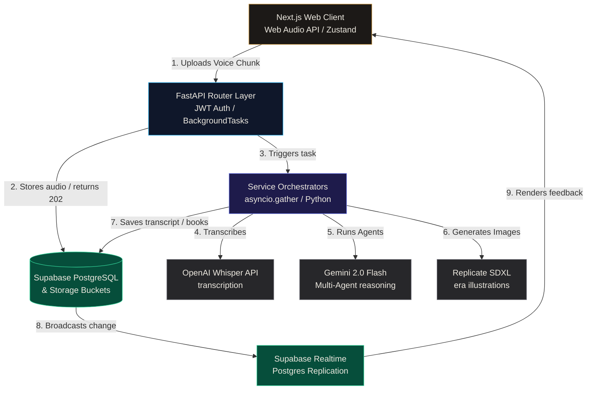
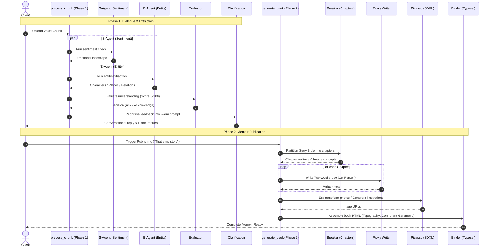

# Kahoma — Voice-First AI Memoir Platform

> **"Every life holds a story worth telling, but most people will never write a book."**
> 
> Kahoma is a production-grade memoir platform that enables users to speak their life stories and automatically compiles them into beautifully typeset, publication-ready books. Built with a resilient multi-agent orchestration pipeline, Next.js, FastAPI, and Supabase.

---

## ✦ Live Production Endpoints

*   **Next.js Web Application:** [web-eight-sepia-qpmb3ekh7d.vercel.app](https://web-eight-sepia-qpmb3ekh7d.vercel.app)
*   **FastAPI API Base Service:** [backend-phi-five-39.vercel.app](https://backend-phi-five-39.vercel.app)
*   **API Swagger Docs:** [backend-phi-five-39.vercel.app/docs](https://backend-phi-five-39.vercel.app/docs)
*   **System Health Monitor:** [backend-phi-five-39.vercel.app/health](https://backend-phi-five-39.vercel.app/health)

---

## ✦ System Architecture



---

## ✦ 6-Agent AI Pipeline Flow

When storytelling, Kahoma processes audio chunks and generates books through a structured multi-agent loop:



---

## ✦ Key Engineering Features

1.  **Pydantic Structured Outputs:** Migrated all agent boundaries (`s_agent`, `e_agent`, `evaluator`, `breaker`) to native Pydantic schema verification. Models enforce formatting rules directly at generation time using Gemini's `response_schema` configuration, achieving 100% schema conformance.
2.  **API Resilience (Tenacity Retries):** Wrapped LLM API interactions with `tenacity` exponential backoff retries with random jitter, recovering from transient timeout and rate-limit triggers automatically.
3.  **In-Memory LLM Caching:** Stores and resolves identical agent prompts in sub-milliseconds using SHA-256 hashes of system and user inputs, eliminating token billing during test loops.
4.  **Parallel Execution:** Orchestrates S-Agent and E-Agent tasks concurrently via `asyncio.gather`, cutting Phase 1 processing times by nearly 50%.
5.  **Typeset Compiler:** Binder compiles chapter structures, title pages, running headers, and drop caps onto A5 paperback dimensions using custom CSS print sheets.

---

## ✦ Repository Layout

*   **[documentation.md](file:///g:/kahoma/documentation.md):** System architecture guide, ADR logs, database schema details, and runtime specifications.
*   **[interview_prep.md](file:///g:/kahoma/interview_prep.md):** Full Project Defense Bible, including concept definitions, mock interview questions, and core code path tables.
*   **[resume_points.md](file:///g:/kahoma/resume_points.md):** Quantifiable, JD-optimized resume bullet points for Backend and AI Engineering roles.

---

## ✦ Directory Structure

```text
├── .github/workflows/
│   └── deploy.yml          # GitHub Actions CI/CD Pipeline
├── backend/                    # Python/FastAPI Backend
│   ├── agents/                 # Multi-Agent implementations (binder, breaker, s_agent, etc.)
│   ├── api/v1/                 # FastAPI routers & JWT Auth dependencies
│   ├── core/                   # Caching, audit loggers, and resilient Gemini wrapper
│   ├── schemas/                # Pydantic schema request models
│   ├── tests/                  # Pytest unit and integration test suites
│   ├── main.py                 # Application entrypoint
│   └── requirements.txt        # Python dependencies
├── supabase/                   # Database migrations & configuration
└── web/                        # Next.js Web App
    ├── src/app/                # Client pages, authentication, & global CSS styles
    └── src/hooks/              # Custom hooks (recording levels, Supabase realtime)
```

---

## ✦ Getting Started

### Prerequisites
*   Node.js v20+
*   Python 3.12 (with py launcher)

### Local Configuration
Create `backend/.env`:
```ini
SUPABASE_URL=https://your-ref.supabase.co
SUPABASE_SERVICE_ROLE_KEY=your-service-role-key
SUPABASE_ANON_KEY=your-anon-key
SUPABASE_JWT_SECRET=your-jwt-secret

GEMINI_API_KEY=your-gemini-key
OPENAI_API_KEY=your-openai-key
REPLICATE_API_KEY=your-replicate-key

MOCK_MODE=true # Keep true to run tests and debug cost-free
```

### Running Backend
```bash
cd backend
pip install -r requirements.txt
py main.py
```

### Running Frontend
```bash
cd web
npm install
npm run dev
```

### Running Tests
Execute the comprehensive Pytest suite:
```bash
cd backend
py -m pytest tests/ -v
```

---

## ✦ License & Acknowledgement
Kahoma is built for family heritage preservation. Named after Kahoma. Speak, be remembered.
